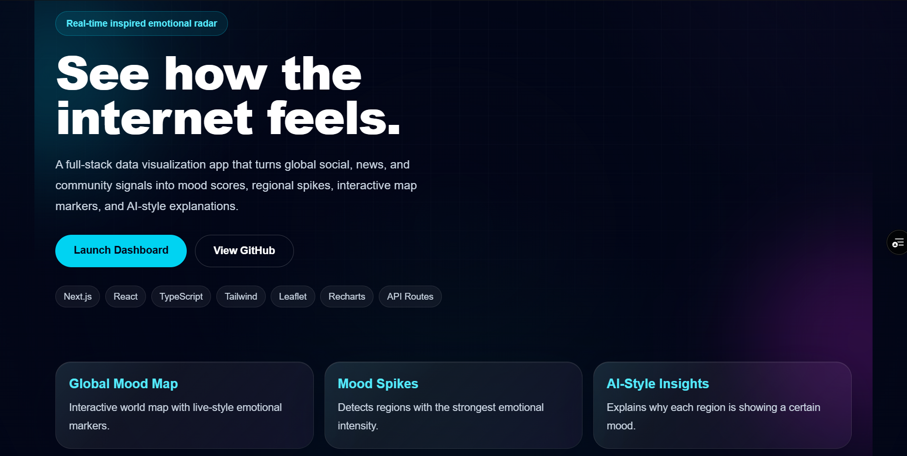
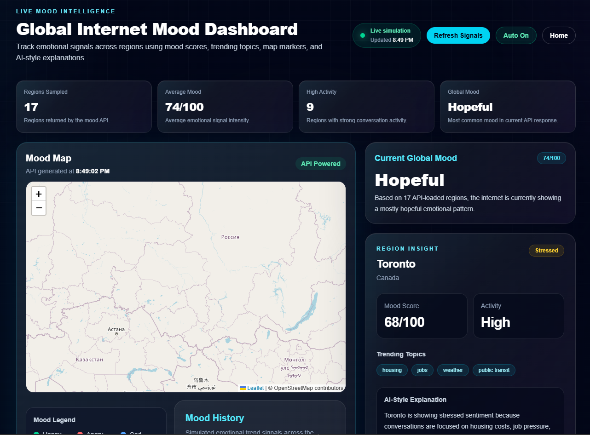
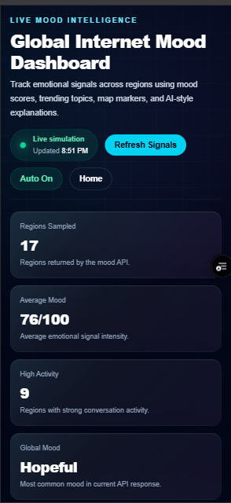

# Internet Mood Map

A real-time inspired global mood intelligence dashboard that visualizes how the internet feels across the world.

Internet Mood Map turns simulated social, news, and community signals into emotional insights using an interactive world map, live-style mood scores, top regional spikes, trend explanations, and mood history charts.

The project is built as a portfolio-level full-stack web app using Next.js, React, TypeScript, Tailwind CSS, Leaflet, Recharts, and Next.js API routes.

> Current MVP uses realistic simulated data to demonstrate the product experience, API-driven architecture, and data visualization workflow. The system is designed so real news/social APIs, NLP models, and database storage can be added later.

---

## Key Highlights

- Interactive global map with pulsing mood markers
- API-powered dashboard using `GET /api/mood`
- Live simulated mood updates with manual and auto-refresh
- Search and filtering by country, city, mood, and topic
- Top mood spike detection by region
- Mood history visualization with Recharts
- AI-style regional explanations
- Responsive futuristic dashboard UI

---

## Live Demo

Live site: https://internet-mood-map.vercel.app/

Dashboard: https://internet-mood-map.vercel.app/dashboard

API route: https://internet-mood-map.vercel.app/api/mood

---

## Preview

### Landing Page



### Dashboard



### Mobile Dashboard

## 

## Core Idea

The internet produces emotional signals every second through news, social media, online communities, sports, politics, entertainment, and global events.

Internet Mood Map turns those signals into a visual dashboard where users can explore:

- what different regions are feeling
- which topics are trending
- where emotional spikes are happening
- how mood changes over time
- why a region may be showing a certain emotional pattern

The current MVP uses realistic simulated data, but the structure is designed so real APIs, NLP models, and databases can be added later.

---

## Features

### Interactive Global Mood Map

- Displays global regions on an interactive Leaflet map
- Uses custom pulsing mood markers
- Marker colors represent emotional categories
- Clicking a marker updates the region insight panel

### Region Mood Intelligence

Each region includes:

- country and city
- mood category
- mood score
- activity level
- trending topics
- AI-style explanation

### Mood Categories

The dashboard supports multiple emotional states:

- happy
- angry
- sad
- stressed
- excited
- confused
- fearful
- hopeful
- chaotic

### Search and Filtering

Users can search by:

- country
- city
- mood
- trending topic

Users can also filter by mood category.

### Top Mood Spikes

The dashboard ranks the regions with the strongest emotional intensity scores.

### Mood History Chart

A Recharts line chart visualizes how mood categories change throughout the day.

### API-Powered Data Flow

The dashboard fetches data from a Next.js API route:

```
GET /api/mood
```

The API returns:

- generated timestamp
- summary statistics
- global mood
- average mood score
- region mood data
- mood history data

### Live Simulation

The API slightly randomizes mood scores on each request to simulate near-real-time updates.

The dashboard supports:

- manual refresh
- auto-refresh every 30 seconds
- API-generated timestamp display

### Responsive UI

The layout is designed to work across laptop and mobile screen sizes.

---

## Tech Stack

| Area            | Technology              |
| --------------- | ----------------------- |
| Framework       | Next.js                 |
| UI Library      | React                   |
| Language        | TypeScript              |
| Styling         | Tailwind CSS            |
| Map             | Leaflet + React Leaflet |
| Charts          | Recharts                |
| API Layer       | Next.js Route Handlers  |
| Version Control | Git + GitHub            |
| Deployment      | Vercel planned          |

---

## Current Architecture

```txt
Frontend Dashboard
        |
        | fetch("/api/mood")
        v
Next.js API Route
        |
        | generates simulated live mood data
        v
Mood Data Response
        |
        | regions, summary, history, generatedAt
        v
Dashboard UI Updates
```

---

## Project Structure

```txt
internet-mood-map/
│
├── app/
│   ├── api/
│   │   └── mood/
│   │       └── route.ts
│   ├── dashboard/
│   │   └── page.tsx
│   ├── globals.css
│   ├── layout.tsx
│   └── page.tsx
│
├── components/
│   ├── Dashboard/
│   │   ├── LiveStatus.tsx
│   │   ├── MoodHistoryChart.tsx
│   │   ├── PipelineStatus.tsx
│   │   ├── RegionCard.tsx
│   │   ├── RegionFilters.tsx
│   │   ├── RegionInsight.tsx
│   │   ├── StatCard.tsx
│   │   └── TopMoodSpikes.tsx
│   │
│   └── Map/
│       ├── MoodLegend.tsx
│       ├── MoodMap.tsx
│       └── MoodMapWrapper.tsx
│
├── data/
│   └── mockMoodData.ts
│
├── lib/
│   ├── moodStyles.ts
│   └── moodUtils.ts
│
└── README.md
```

---

## How to Run Locally

### 1. Clone the repository

```bash
git clone <your-repo-url>
```

### 2. Go into the project folder

```bash
cd internet-mood-map
```

### 3. Install dependencies

```bash
npm install
```

### 4. Run the development server

```bash
npm run dev
```

### 5. Open the app

Home page:

```txt
http://localhost:3000
```

Dashboard:

```txt
http://localhost:3000/dashboard
```

API route:

```txt
http://localhost:3000/api/mood
```

---

## Optional Database Setup (Supabase / Postgres + Prisma)

The app runs fully without a database. When you want to persist mood
snapshots over time (powers Phase 6 historical history), point Prisma at
any PostgreSQL instance — Supabase, Neon, Railway, or local Docker.

### 1. Configure environment variables

Copy `.env.example` to `.env.local` and fill in:

```bash
DATABASE_URL=postgresql://...           # pooled / runtime connection
DIRECT_URL=postgresql://...             # direct connection for migrations (Supabase)
ENABLE_SNAPSHOT_WRITES=true             # opt-in: write a snapshot on each /api/mood call
```

`ENABLE_SNAPSHOT_WRITES` is **opt-in**. Just setting `DATABASE_URL` does
NOT make `/api/mood` write to the DB — you have to explicitly enable it.

### 2. Generate the Prisma client

```bash
npm run prisma:generate
```

(`postinstall` also runs this automatically, so a fresh `npm install`
should already have the client ready.)

### 3. Apply migrations

```bash
npm run prisma:migrate          # interactive: creates a new migration if needed
```

### 4. Seed the 17 regions

```bash
npm run prisma:seed
```

The seed is idempotent — safe to rerun.

### 5. Inspect the data (optional)

```bash
npm run prisma:studio
```

### What the database unlocks

When `DATABASE_URL` is configured AND `ENABLE_SNAPSHOT_WRITES=true`:

- Every `/api/mood` call writes one `MoodSnapshot` row per region plus
  any matched topics, with `generatedAt` set to the response timestamp.
- The mood history chart starts reading from those snapshots as soon as
  there are enough buckets (default: 3 distinct request timestamps).
  Each chart point shows the average `moodScore` across regions, per
  tracked emotion (happy, stressed, excited, hopeful, chaotic), per
  bucket.
- The API response includes `historySource: "database"` so the
  dashboard (and future UI badges) can distinguish real vs simulated
  history.

If you skip all of the above, `/api/mood` continues to work using the
mock / live-simulation / hybrid / real data paths exactly as before
and `historySource` falls back to `"mock"`.

---

## Current MVP Data Strategy

The MVP currently uses simulated global mood data.

This was done intentionally because real social media APIs can be expensive, rate-limited, restricted, or difficult to access.

The simulated data allows the project to demonstrate:

- product design
- full-stack structure
- data visualization
- API-driven architecture
- map interactions
- live dashboard behavior

---

## Future Improvements

Planned improvements include:

- connect real news or RSS data sources
- use GDELT for global news/event signals
- add NLP sentiment and emotion classification
- generate AI-powered regional explanations
- store mood snapshots in PostgreSQL or Supabase
- add Prisma for database modeling
- add historical mood playback
- add region comparison tools
- add public share cards
- improve mobile dashboard polish
- deploy live on Vercel

---

## What I Learned

This project demonstrates experience with:

- building a full-stack Next.js app
- creating API routes
- fetching and rendering API data in React
- managing state with React hooks
- building reusable UI components
- working with TypeScript types
- creating interactive maps with Leaflet
- visualizing data with Recharts
- designing responsive dashboard layouts
- using Git checkpoints during development
- structuring a portfolio-level web project

---

## Status

MVP complete and deployed.

Live app: https://internet-mood-map.vercel.app/

Current version includes a working landing page, interactive dashboard, API-powered mood data, live simulated updates, search/filtering, mood history chart, pulsing map markers, and README screenshots.

Next phase will focus on real data sources, NLP sentiment analysis, AI-generated explanations, and database-backed mood history.

Completed:

- landing page
- dashboard layout
- interactive map
- mood markers
- region insight panel
- search and filters
- top mood spikes
- mood history chart
- API route
- live simulated updates
- manual refresh
- auto-refresh

Next:

- GitHub push
- deployment
- screenshots
- final polish
